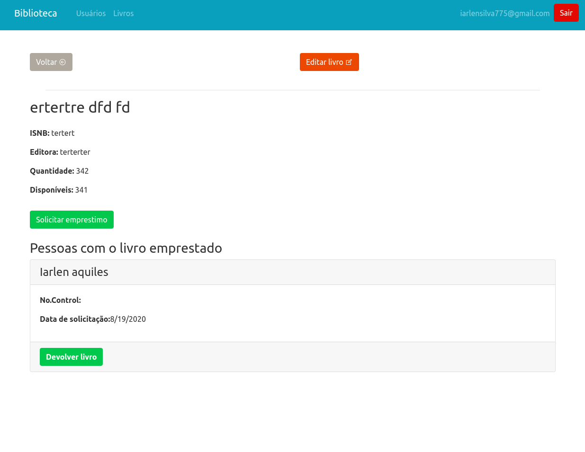

# :computer: Aplicação Web em ReactJS para gerenciar uma biblioteca

## Tecnologias

- react
- react-dom
- react-icons
- react-router-dom
- Firebase
- Redux
- Firestore
- sweetalert2

## Run

- Copiar o env.example para .env e inserir os dados do SDK do Firebase
- git clone
 - yarn
 - yarn start
